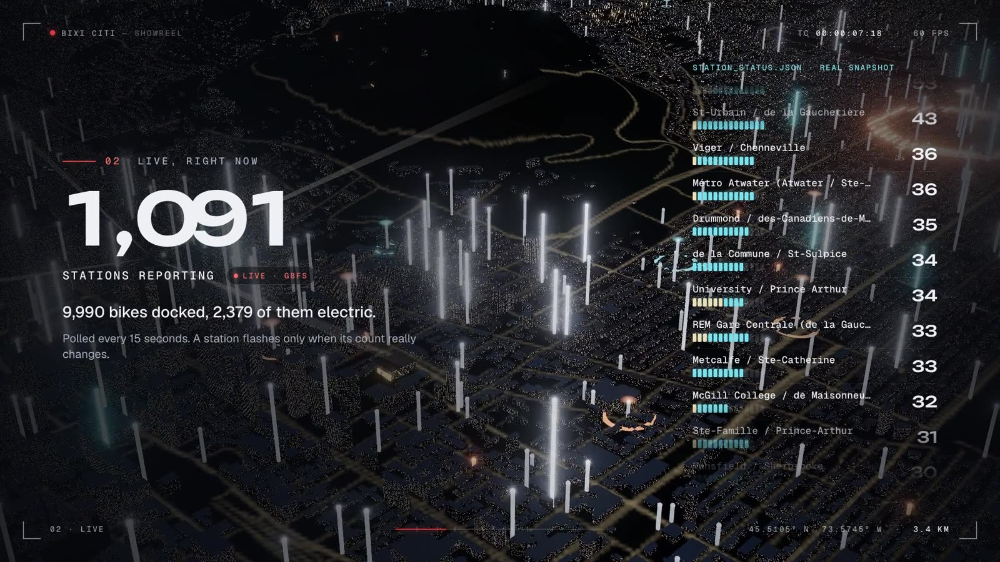

# BIXI Citi

Storytelling with BIXI data: an unofficial, interactive 3D portrait of [BIXI Montréal](https://bixi.com) bike share, built from open data.

- **Live**: the current state of every station from BIXI's GBFS feed. A station pulses when its bike count drops (a bike left) or rises (a bike docked) between two snapshots. BIXI publishes no live trips, so none are drawn.
- **Flows**: every ride of one real summer day from the yearly trip history, played back over the city with the sun moving with the clock. One arc is one ride.
- **Rhythm**: average trips for each hour of the week, with that hour's busiest corridors drawn on the map.
- **Stations**: which stations gain or lose bikes on an average day. Bikes roll downhill toward the river, and trucks carry them back up.
- **Years**: every season of open data since 2014 (13 yearly files, 91 M rides). Each year has its rides-per-day calendar, peak and quietest days, busiest hour and routes, and growth on the previous year over the same months. Play fast-forwards through the season: stations rise with that day's departures, a sample of its rides flashes across the city, the 17:30 sun follows the calendar, and playback rolls on into the next year.

Every number on the page carries a chip: **LIVE** (GBFS), **REAL** (counted from individual trips), or **DERIVED** (averages, or slopes computed from terrain).

Design & build: **Sora Bon (Soroush Bonab)** · [linktr.ee/soroucsh](https://linktr.ee/soroucsh)

[](video/bixi-citi-showreel.mp4)

**Showreel**: [video/bixi-citi-showreel.mp4](video/bixi-citi-showreel.mp4), 30 s at 1080p60. On the site, the share button (top right) plays it. It is made from the app itself (see [video/](video/README.md)).

Made for laptops and desktops. Phones get a short note asking to open it on a bigger screen, and load nothing else.

> Unofficial and not affiliated with BIXI Montréal. Trip data: [BIXI open data](https://bixi.com/en/open-data/). Map data © [OpenStreetMap contributors](https://www.openstreetmap.org/copyright). Elevation: [AWS Terrain Tiles](https://registry.opendata.aws/terrain-tiles/).

## How it works

```
                    ┌───────────────────── browser ─────────────────────┐
 gbfs.velobixi.com ─┤ /api/gbfs/status   (route handler, CDN-cached ~30 s)│── poll, diff snapshots → pulses
                    │ /api/gbfs/stations (CDN-cached 1 h)                 │
                    │                                                     │
 GitHub Actions ────┤ public/data/history/*  (daily, only when BIXI's zip changes)
  (daily)           │ public/city/*          (OSM + DEM, rebuilt on demand) │── three.js scene + SVG charts
                    └─────────────────────────────────────────────────────┘
```

**Next.js on Vercel, no other server.** The two route handlers trim BIXI's feeds (station_status is about 0.5 MB, the trimmed columnar form about 17 KB). They send `s-maxage` + `stale-while-revalidate` headers so the CDN serves one copy to every visitor.

**Trip history never touches Vercel functions.** `.github/workflows/history.yml` runs `scripts/history/update.ts` daily:

1. It reads the open-data page and lists every yearly zip. The current year's filename grows as months are added.
2. It compares each zip's URL and ETag with what `public/data/years/index.json` was built from, and downloads only new or changed years. `cdn.bixi.com` blocks browser requests, so the download has to happen in CI.
3. `scripts/history/years.ts` reads any of BIXI's file layouts (`scripts/history/read-trips.ts`: 2014–2020 station codes and local times, 2021's `emplacement_pk`, 2022 onward names, coordinates and epoch ms). Each year is processed once: a build-side summary goes to `data/years/`, and the browser gets one content-hashed `public/data/years/{year}.{hash}.pack.gz` (stations, departures per station-day, that day's balance, 200 sampled rides per day) plus a shared `summaries.{hash}.json`. Hashed files are served `immutable`, so a past year downloads once per browser; only the current year's pack changes.
4. For the newest year, `scripts/history/aggregate.ts` streams the ~2 GB CSV through `unzip -p` and keeps trips as typed columns, about 12 bytes per trip. It writes:
   - `meta.json`: totals, the story day, and per-chapter numbers that the captions quote.
   - `stations.json`: per-station hourly departures and arrivals for weekdays and weekends, plus net bikes per day.
   - `rhythm.json`: hour-of-week averages and 10-minute curves.
   - `flows.bin.gz`: the top 140 origin–destination pairs for each hour of the week.
   - `day/{0..3}.bin.gz`: every ride of the story day, delta-coded and loaded in 6-hour chunks.
5. CI commits the outputs, and Vercel redeploys.

The story day is the Tuesday, Wednesday or Thursday at the 90th percentile of weekday volume, skipping holidays. It's busy without being an outlier.

**The city is real geometry.** `scripts/city/fetch-osm.ts` pulls buildings, water, parks, streets and bike lanes for Montréal, Laval and the South Shore from Overpass. Public Overpass servers are often overloaded, so each query declares a 60 s budget over a small tile and starts on the main instance, falling back to mirrors. A tile that is too heavy gets split into quadrants, and every answer is cached in `.cache/osm`, so a rerun resumes where it stopped.

If the Overpass cache is still incomplete when the build runs, `scripts/city/pbf.ts` reads [BBBike's Montréal extract](https://download.bbbike.org/osm/bbbike/Montreal/) instead. It is the same OpenStreetMap data as a single `.osm.pbf`, decoded by a small reader into the same element shape. The committed geometry came from that extract, because Overpass refused connections during the first build. Set `OSM_SOURCE=overpass|pbf` to force one source. `scripts/city/build-city.ts` then writes:

- `terrain.bin.gz`: a 60 m grid from AWS Terrain Tiles, with the water surface estimated from the DEM. The rapids keep their slope.
- `ground.webp` + `bikes.webp`: 10 m lossless ground textures (land, parks, streets; bike network).
- `blocks.bin.gz`: the far level of detail. It has one box per 62.5 m cell of Montréal's street grid (rotated 32°, the way Montréal's "north" is), so distant neighbourhoods still read as blocks.
- `tiles/*.bin.gz`: detailed footprints, one file per 1 km grid tile. Heights come from OSM `height`/`building:levels`, and towers use their `building:part`s.

**The scene** (`scene/`) is plain three.js, loaded after first paint:

- Terrain and water use custom shader chunks. Water flow follows the surface gradient, so the Lachine rapids run fast and white while lakes barely drift.
- A Web Worker triangulates detailed tiles off the main thread. Tiles near the camera, plus tall ones on the skyline, stream in and grow out of their blocks. Distant ones are disposed.
- All ~80,000 story-day rides are instanced ribbons animated in the vertex shader from one clock uniform. Per frame, the CPU only toggles hourly buckets.
- The sun is computed with SunCalc's formulas for the story date (or now, in Live) and drives sky colour, shadows, night windows, bike-lane glow and bloom.
- Quality starts from a GPU and device guess. A governor then steps down ambient occlusion, pixel ratio, tile budget and shadows if frames stay slow. Modern laptops are the target.

## Develop

Node 22 (`.nvmrc`).

```bash
npm install
npm run dev              # http://localhost:3000
npm test                 # vitest (snapshot diffing)
npm run typecheck && npm run lint
```

Regenerate data locally (everything downloaded lands in the gitignored `.cache/`):

```bash
npm run city:fetch                       # Overpass, resumable; slow when servers are busy (optional)
npm run city:build                       # → public/city (falls back to the PBF extract)
npm run history:update                   # what CI runs: download and rebuild changed years
npm run history:years -- --all           # rebuild every year from zips already in .cache/history
```

### Visitor counter

The tab in the bottom-left margin shows how many people have the site open, and on hover the unique visitors today (since midnight in Montréal) and in total. Each browser gets a random id in localStorage (no cookies). `/api/presence` keeps a Redis sorted set of heartbeats for "online now" and HyperLogLogs for the unique counts, so ids aren't stored for the totals. The shared `GET` is cached at the edge for 15 s. A visitor costs one Redis command a minute, plus eight when the page opens.

It needs a Redis database with a REST API. On Vercel: Storage → Create → Upstash for Redis (free tier) → connect it to the project, which adds `KV_REST_API_URL` and `KV_REST_API_TOKEN`; then redeploy. `UPSTASH_REDIS_REST_URL` / `UPSTASH_REDIS_REST_TOKEN` work too. Without them, `npm run dev` counts in memory and production hides the tab.

## Layout

| Path | What |
| --- | --- |
| `app/` | page shell, global styles, GBFS route handlers |
| `components/` | console UI, SVG charts, tour, share sheet with the showreel player |
| `lib/` | shared projection, binary formats, stores, data loading, story chapters, sun |
| `scene/` | three.js scene: terrain, water, city LOD, stations, trips, pulses |
| `scripts/` | city and history pipelines |
| `public/city`, `public/data/history` | generated, committed assets |
| `public/video` | the showreel the share sheet plays, and its poster |
| `video/` | how the showreel is made: capture, composition, soundtrack, render |
| `docs/` | the original brief and interactive mockup |
